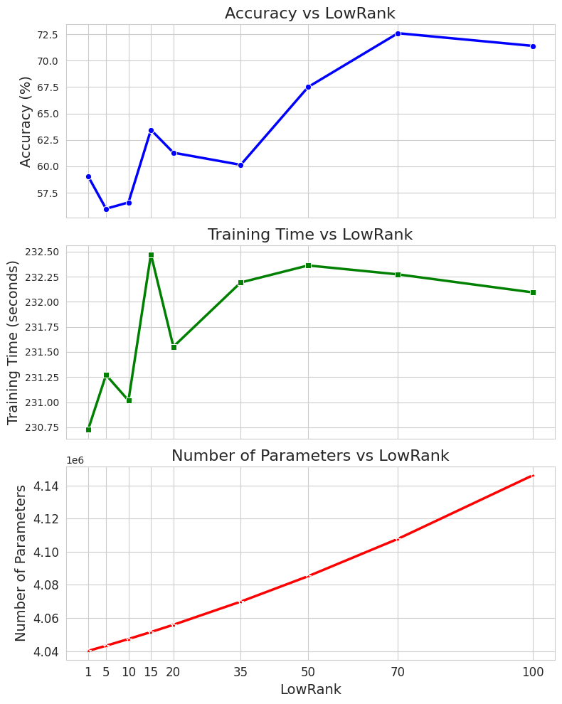

# Model Compression & Efficiency Optimization

**An empirical study of low-rank neural networks using SVD and LoRA in PyTorch.**

This project explores the trade-off between classification accuracy, trainable parameter count, training time, and GPU memory. It covers Persian handwritten digit recognition, adaptation to clothing classification, and sentiment analysis with a custom Transformer.

Developed by **Nazanin Bazgir**. See the [project report](docs/project_report.pdf).

## Objectives and experiments

1. **HODA / SVD-MLP:** train a `1024 → 200 → 150 → 10` MLP and compare it with trainable low-rank factors initialized by SVD of random matrices.
2. **Fashion-MNIST / LoRA:** freeze the HODA-pretrained MLP and learn additive low-rank adapters; compare with an MLP trained from scratch on Fashion-MNIST.
3. **IMDB / Transformer:** compare a custom baseline Transformer with an attention implementation that learns SVD factors for the query, key, and value matrices.

The implementation includes training and evaluation loops, rank sweeps, learning curves, confusion matrices, and parameter/resource measurements. The BERT tokenizer is used for preprocessing; the classifiers are custom models, not pretrained BERT models.

## Historical results

These values come from the **saved notebook outputs and original report**, not from newly trained models. Accuracy is measured on each experiment's test split.

| Dataset | Configuration | Test accuracy | Trainable parameters |
|---|---|---:|---:|
| HODA | Baseline MLP | 98.28% | 236,660 |
| HODA | SVD-MLP, rank 10 | 93.765% | 17,340 |
| Fashion-MNIST | MLP trained from scratch | 88.75% | 236,660 |
| Fashion-MNIST | LoRA, rank 20 | 87.36% | 34,680 |
| Fashion-MNIST | LoRA, rank 100 | 87.66% | 173,400 |
| IMDB | Baseline Transformer | 82.73% | 4,302,594 |
| IMDB | SVD Transformer, rank 70 | 72.596% | 4,107,758 |

For HODA, rank 10 uses **92.7% fewer trainable parameters**, with a roughly **4.52 percentage-point** accuracy drop. Fashion-MNIST LoRA at rank 20 uses **85.3% fewer trainable parameters** than the fully trained baseline, with a **1.39 percentage-point** drop. LoRA retains the frozen base weights, so this is a reduction in *trainable parameters*, not total model storage.

The recorded Transformer runs took 112.20 seconds for the baseline and 232.27 seconds for rank 70. They use different layer counts, head counts, learning rates, and epoch counts, so these are descriptive results, **not a controlled speedup comparison**. The low-rank implementation reconstructs dense attention weights during each forward pass.



See [historical results and figures](results/) for the full sweeps and [reproducibility notes](docs/REPRODUCIBILITY.md) for scientific limitations retained from the original work.

## Datasets

| Dataset | Task | Train / test | Preprocessing and availability |
|---|---|---|---|
| HODA | Ten Persian digit classes | 60,000 / 20,000 | Aspect-preserving resize/padding to 32×32, normalization, thresholding at 0.5, flattening to 1,024 features. Local `.cdb` files required. |
| Fashion-MNIST | Ten clothing classes | 60,000 / 10,000 | Resize to 32×32, tensor conversion, normalization with mean 0.2860 and std 0.3530. Downloaded by torchvision. |
| IMDB | Binary movie-review sentiment | 25,000 / 25,000 | `bert-base-uncased` tokenizer; padding/truncation to 512 tokens. Downloaded by Hugging Face Datasets. |

Place `Train 60000.cdb` and `Test 20000.cdb` in `data/raw/hoda/`. The supplied `RemainingSamples.cdb` is preserved locally but is not used in these experiments. See [data notes](data/README.md). Dataset files and caches are excluded from Git; the local files have not been deleted.

## Setup

Run commands from the repository root. The validation environment uses Python 3.13 and a CPU build of PyTorch; an isolated environment avoids changing your existing packages.

```bash
python -m venv .venv
```

Activate on Windows PowerShell:

```powershell
.\.venv\Scripts\Activate.ps1
```

Or on Linux/macOS:

```bash
source .venv/bin/activate
```

Install the CPU runtime and project dependencies:

```bash
python -m pip install torch==2.8.0 torchvision==0.23.0 --index-url https://download.pytorch.org/whl/cpu
python -m pip install -r requirements.txt
python -m ipykernel install --user --name compression-efficiency --display-name "Compression & Efficiency"
python -m jupyter lab
```

Select the **Compression & Efficiency** kernel. Full Transformer runs are computationally expensive on CPU. For GPU runs, use a compatible CUDA build of the same PyTorch/torchvision pair in a separate environment. The original GPU timings should not be expected on another machine.

## Run the experiments

Open the notebooks and use **Restart Kernel and Run All Cells**:

| Notebook | Purpose |
|---|---|
| [01_hoda_mlp_svd.ipynb](notebooks/01_hoda_mlp_svd.ipynb) | Baseline MLP and eight SVD ranks; 30 epochs per configuration |
| [02_fashion_mnist_lora.ipynb](notebooks/02_fashion_mnist_lora.ipynb) | Baseline and eleven LoRA ranks; 20 epochs per configuration |
| [03_imdb_transformer_baseline.ipynb](notebooks/03_imdb_transformer_baseline.ipynb) | Baseline Transformer; 5 epochs |
| [04_imdb_transformer_svd.ipynb](notebooks/04_imdb_transformer_svd.ipynb) | Nine SVD attention ranks; 10 epochs per configuration |

Paths resolve from the repository or its subdirectories. Notebook 01 saves new checkpoints to `outputs/`; it does not overwrite the preserved checkpoints in `models/`. Notebook 02 deliberately loads the preserved HODA weights from `models/mlp_weights.pth`. Internet access is required for the first Fashion-MNIST/IMDB/tokenizer download.

Run the automated checks:

```bash
python scripts/validate_project.py --evaluate --smoke
python -m pip check
```

`--evaluate` evaluates the preserved checkpoint on all 20,000 HODA test samples. `--smoke` executes every cell in all four notebooks using one epoch, ranks 1 and 10, a small real HODA subset, synthetic image/text fixtures, and a local miniature tokenizer. These offline checks exercise training, evaluation, plotting, data mapping and checkpoint loading; they **do not reproduce the full experiments or validate remote downloads**. Executed test notebooks are written under `outputs/validation/`.

See [validation results](docs/VALIDATION.md) for the actual checks performed and their limits.

## Repository structure

```text
├── notebooks/                 # Four portable experiment notebooks; saved results retained
├── src/HodaDatasetReader.py   # Original HODA preprocessing implementation
├── models/                    # Preserved HODA state dictionary
├── data/
│   ├── README.md
│   └── raw/hoda/              # Local data, ignored by Git
├── results/                   # Historical metrics and extracted figures
├── docs/                      # Report, audit and validation documentation
├── scripts/validate_project.py
├── archive/originals/          # Exact original notebooks, local and ignored by Git
├── outputs/                   # New checkpoints and validation runs, ignored by Git
├── requirements.txt
└── .gitignore
```

## Preservation and publication

No original file or dataset was deleted. Original notebooks and the original report are retained byte-for-byte in the local archive. The complete original report, including its original title page, is published unchanged at the author's request. The reader, data, and checkpoints remain unmodified. [The manifest](docs/original_file_manifest.json) records the original paths, preserved paths, file sizes and SHA-256 hashes. [The change summary](docs/CHANGE_SUMMARY.md) documents the new names, exclusions and portability edits.

One original plotting notebook is corrupted, and the supplied Transformer starter notebook contains TODOs; both are preserved outside the runnable notebook set. A software license was not supplied, so this preparation does not assign a new license or relicense third-party materials.

See [publication review](docs/PUBLICATION_REVIEW.md) for the final staged-file audit and local-only exclusions.
